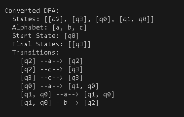

# Determinism in Finite Automata. Conversion from NDFA 2 DFA. Chomsky Hierarchy.
### Course: Formal Languages & Finite Automata
### Author: Pleșu Dinu FAF-241

----

## Theory

#### A finite automaton (FA) is a computational model used to recognize patterns in strings. It consists of:

- Q (States): A finite set of states.
- Σ (Alphabet): A finite set of input symbols.
- δ (Transition function): Defines state changes based on input symbols.
- q₀ (Start state): The state where execution begins.
- F (Final states): Accepting states that determine if a string is valid.

#### Deterministic vs. Non-Deterministic Finite Automata
- **Deterministic Finite Automaton (DFA):** Each state has exactly one transition for each symbol in the alphabet.
- **Non-Deterministic Finite Automaton (NDFA):** A state can have multiple transitions for the same symbol or ε-moves (empty transitions).


#### NDFA to DFA Conversion
The subset construction algorithm is used to convert an NDFA into an equivalent DFA:
1. Each state in the DFA represents a set of states in the NDFA.
2. Process all transitions from the NDFA to form deterministic transitions.
3. Identify final states as those that contain any accepting state from the NDFA.

#### Chomsky Hierarchy
Grammars are classified into four types:
- **Type 0 (Unrestricted Grammar):** No restrictions on production rules.
- **Type 1 (Context-Sensitive Grammar):** Productions must maintain string length or increase it.
- **Type 2 (Context-Free Grammar):** Each production has a single non-terminal on the left-hand side.
- **Type 3 (Regular Grammar):** Productions follow strict forms (A → aB or A → a).

## Objectives:

1. Understand what an automaton is and what it can be used for.

2. Continuing the work in the same repository and the same project, the following need to be added:
    a. Provide a function in your grammar type/class that could classify the grammar based on Chomsky hierarchy.

    b. For this you can use the variant from the previous lab.

3. According to your variant number (by universal convention it is register ID), get the finite automaton definition and do the following tasks:

    a. Implement conversion of a finite automaton to a regular grammar.

    b. Determine whether your FA is deterministic or non-deterministic.

    c. Implement some functionality that would convert an NDFA to a DFA.
    
    d. Represent the finite automaton graphically (Optional, and can be considered as a __*bonus point*__):
      
    - You can use external libraries, tools or APIs to generate the figures/diagrams.
        
    - Your program needs to gather and send the data about the automaton and the lib/tool/API return the visual representation.

Please consider that all elements of the task 3 can be done manually, writing a detailed report about how you've done the conversion and what changes have you introduced. In case if you'll be able to write a complete program that will take some finite automata and then convert it to the regular grammar - this will be **a good bonus point**.

### Variant 20 Details
For this lab, the finite automaton is defined as follows:

- States: Q = {q0, q1, q2, q3}
- Alphabet: Σ = {a, b,c}
- Final State: F = {q3}
- Transitions (δ):\
δ(q0,a) = q0\
δ(q0,a) = q1\
δ(q2,a) = q2\
δ(q1,b) = q2\
δ(q2,c) = q3\
δ(q3,c) = q3\
(Note: The nondeterminism appears here with two targets for symbol 'a' and 'c'.)\

### Main Class
The Main class instantiates the NDFA for Variant 20 displays its properties, converts it to a DFA, and then displays the result. This serves as a client to demonstrate the functionality of the FA conversion.

## Implementation description

## **FiniteAutomaton Class**

### Attributes
- **`states`**: Set of states in the automaton.
- **`alphabet`**: Set of input symbols (characters).
- **`transitions`**: Mapping of states and symbols to the set of possible next states.
- **`startState`**: The initial state.
- **`finalStates`**: Set of accepting (final) states.

### 1. **`isDeterministic()` Method**

This method checks if the finite automaton is deterministic (DFA) by verifying if any transition from a state leads to **more than one** destination state.

#### Principle:
In a DFA, each state and input symbol pair must have **exactly one** next state. If any symbol leads to **multiple** states, the automaton is **non-deterministic**.

```java
for (Map<Character, Set<String>> stateTransitions : transitions.values()) {
    for (Set<String> destStates : stateTransitions.values()) {
        if (destStates.size() > 1) {
            return false; // NDFA found
        }
    }
}
return true; 
```

### 2. **`toDFA()` Method**

This method implements the **subset construction algorithm** to convert an NDFA to an equivalent DFA.

#### Principle:
Each DFA state represents a **set of NDFA states**. By tracking how sets of NDFA states transition under each input symbol, we construct the DFA.

#### Process Flow:

1. **Initialize:**

   - Create a queue for unmarked states.
   - Add the initial state of the NDFA as the starting DFA state.

   This step sets up the groundwork for tracking newly discovered DFA states. Each NDFA state is grouped into a composite DFA state. The queue helps manage these new sets as they are discovered but not yet processed.

2. **Process States:**

   - For each unmarked DFA state:
      - Compute the next state for each input symbol by following transitions from all states in the current set.
      - If the new state is unseen, add it to the DFA and mark it for further exploration.

   This loop systematically explores every possible transition, ensuring all reachable states are included. If a new set of NDFA states is encountered, it is added to the DFA's state collection and further examined.

   Additionally, during this process, we must carefully track and record how each DFA state maps to transitions. By iterating through all input symbols and their corresponding states, we ensure every possible path is captured.

3. **Handle Final States:**

   - If any NDFA final state appears in a DFA state, mark it as a DFA final state.

   Since each DFA state is a combination of NDFA states, if **any** NDFA final state is included in a DFA state, that DFA state also becomes an accepting state. This ensures the DFA correctly recognizes the language of the original NDFA.

   This step is crucial because even if a portion of a DFA state corresponds to an NDFA final state, the DFA must be marked as accepting to maintain equivalence with the original NDFA.

```java
Set<String> initialState = new HashSet<>(Collections.singleton(startState));
dfaStates.add(initialState);

Queue<Set<String>> unmarkedStates = new LinkedList<>();
unmarkedStates.add(initialState);

while (!unmarkedStates.isEmpty()) {
    Set<String> currentState = unmarkedStates.poll();
    Map<Character, Set<String>> currentTransitions = new HashMap<>();

    for (char symbol : alphabet) {
        Set<String> newState = new HashSet<>();
        for (String state : currentState) {
            if (transitions.containsKey(state) && transitions.get(state).containsKey(symbol)) {
                newState.addAll(transitions.get(state).get(symbol));
            }
        }

        if (!newState.isEmpty() && !dfaStates.contains(newState)) {
            dfaStates.add(newState);
            unmarkedStates.add(newState);
        }

        currentTransitions.put(symbol, newState);
    }

    dfaTransitions.put(currentState, currentTransitions);
}
```

### 3. **`getGrammarType()` Method**

Identifies the automaton as recognizing a **Type-3 grammar** (regular grammar) according to the **Chomsky hierarchy**.
---

## **DFA Class**

The `DFA` class models the deterministic automaton resulting from the conversion.

### Attributes
- **`states`**: Set of DFA states (each state represents a set of NDFA states).
- **`alphabet`**: Input alphabet.
- **`transitions`**: Transition map for each DFA state.
- **`startState`**: Initial DFA state.
- **`finalStates`**: Set of accepting states.

### `toString()` Method

This method provides a readable representation of the DFA:

---

## **Main Class**

### Overview
1. **Defines an NDFA** with states, alphabet, transitions, start state, and final states.
2. **Determines** whether the automaton is deterministic.
3. **Converts** the NDFA to a DFA if necessary.
4. **Displays** the resulting DFA and grammar classification.

```java
FiniteAutomaton fa = new FiniteAutomaton(states, alphabet, transitions, startState, finalStates);
System.out.println("Automaton Type: " + (fa.isDeterministic() ? "DFA" : "NDFA"));

DFA dfa = fa.toDFA();
System.out.println("\n" + dfa);

System.out.println("\nGrammar Classification: " + fa.getGrammarType());
```

---

## Conclusions / Screenshots / Results

- NDFA Definition: Implemented the finite automaton for Variant 20.
- Determinism Check: The automaton correctly identified as non-deterministic.
- NDFA to DFA Conversion: Successfully converted the NDFA to an equivalent DFA using the subset construction algorithm.
- Chomsky Hierarchy: The project lays the foundation for further extensions (e.g., grammar classification) linking finite automata to regular grammars (Type-3) within the Chomsky hierarchy.
- Graphical Representation: (Optional bonus) Visual representation can be generated using external tools/libraries.

This project demonstrates the conversion of a non-deterministic finite automaton into a deterministic one using the subset construction algorithm. Additionally, it shows the derivation of a regular grammar from the automaton, reaffirming its position within the Chomsky hierarchy (Type 3). The modular design allows for easy extensions, such as adding graphical representations or further testing.


## References
- Hopcroft E. and others. Introduction to Automata Theory, Languages and Computation
- LFPC Guide (ELSE)
- Introduction to formal languages (ELSE)
