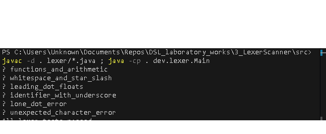

# Lexer & Scanner for Arithmetic with Trig Functions
### Course: Formal Languages & Finite Automata
### Author: Pleșu Dinu FAF-241

----

## Theory
Lexical analysis converts a raw character stream into a stream of typed tokens. Each token couples a lexeme with a category (operator, delimiter, literal, identifier). A lexer typically skips whitespace, consumes characters according to token rules, and raises errors for unknown input. This implementation is hand-written: a single-pass deterministic scanner using a switch/peek loop instead of a generated lexer.

## Objectives
1. Build a lexer that recognizes arithmetic expressions with trig identifiers (`sin`, `cos`), integers, floats, operators, and parentheses.
2. Emit token metadata (type, lexeme, position) and provide clear errors for unexpected characters.
3. Validate behavior with self-checking tests for normal flows and error cases.

## Implementation description
- Token model: `TokenType` enumerates operators, parens, literals, identifiers, and EOF; `Token` stores type, lexeme, and position (see [3_LexerScanner/src/lexer/TokenType.java](3_LexerScanner/src/lexer/TokenType.java) and [3_LexerScanner/src/lexer/Token.java](3_LexerScanner/src/lexer/Token.java)).
- Core lexing loop: scans left-to-right, skips whitespace, dispatches single-character tokens, delegates to number/identifier scanners, throws on unknown input (see [3_LexerScanner/src/lexer/Lexer.java](3_LexerScanner/src/lexer/Lexer.java)).
- Number scanning: accepts integers and floats with at most one dot; rejects a lone dot; emits `INTEGER` or `FLOAT`.
- Identifier scanning: letters followed by alphanumerics or underscore to support trig names and variables.
- Error handling: `LexerException` reports the offending character and position.

## Code snippets

```Java
switch (c) {
	case '+': tokens.add(new Token(TokenType.PLUS, "+", start)); break;
	case '-': tokens.add(new Token(TokenType.MINUS, "-", start)); break;
	case '*': tokens.add(new Token(TokenType.STAR, "*", start)); break;
	case '/': tokens.add(new Token(TokenType.SLASH, "/", start)); break;
	case '^': tokens.add(new Token(TokenType.CARET, "^", start)); break;
	case '(': tokens.add(new Token(TokenType.LPAREN, "(", start)); break;
	case ')': tokens.add(new Token(TokenType.RPAREN, ")", start)); break;
	default:
		if (isDigit(c) || (c == '.' && peekDigit())) tokens.add(numberToken(start, c));
		else if (isAlpha(c)) tokens.add(identifierToken(start, c));
		else throw new LexerException("Unexpected character '" + c + "'", start);
}
```

```Java
run("functions_and_arithmetic", () -> expectTokens("sin(0.5) + cos(2) - 3.14^2 / x", ...));
run("whitespace_and_star_slash", () -> expectTokens("   42 * 7 / 3", ...));
run("leading_dot_floats", () -> expectTokens(".75 + .25", ...));
run("identifier_with_underscore", () -> expectTokens("foo_bar1", ...));
run("lone_dot_error", () -> expectThrows(".", "Unexpected character '.'"));
run("unexpected_character_error", () -> expectThrows("1 @ 2", "Unexpected character '@'"));
```

## Conclusions / Screenshots / Results
- The lexer tokenizes arithmetic with parentheses, power, division/multiplication, identifiers, integers, and floats.
- Error handling surfaces the offending character and position, simplifying debugging of malformed input.
- The built-in harness reports per-test status; current suite passes all positive and negative cases.

## References
[1] [A sample of a lexer implementation](https://llvm.org/docs/tutorial/MyFirstLanguageFrontend/LangImpl01.html)
[2] [Lexical analysis](https://en.wikipedia.org/wiki/Lexical_analysis)