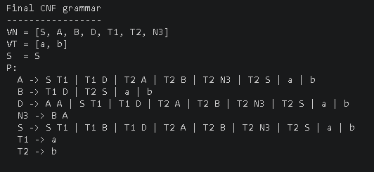
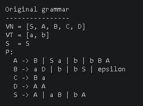
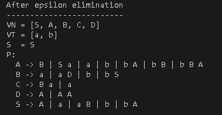
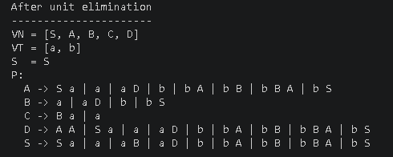
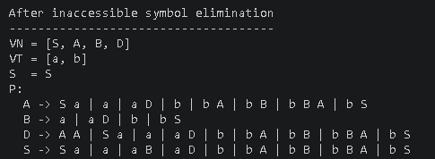
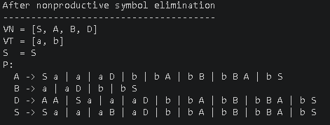

# Topic: Chomsky Normal Form

### Course: Formal Languages & Finite Automata
### Author: Pleșu Dinu FAF-241
### Variant 20

----

## Theory
Chomsky Normal Form is a normalized form of a context-free grammar in which every production has one of the following shapes:
- `A -> BC`
- `A -> a`

This form is useful because it removes irregular rules such as epsilon productions, renaming productions, and long mixed productions. After normalization, the grammar is easier to analyze formally and easier to use in parsing algorithms such as CYK.

## Objectives:
1. Learn what Chomsky Normal Form is and why it is useful.
2. Get familiar with the steps required to normalize a grammar.
3. Implement a method for converting an input grammar to CNF.
4. Execute and test the implementation on the assigned grammar.
5. Keep the converter generic enough to be reusable for grammars beyond the current variant.

## Implementation description
This laboratory work is implemented in Java and uses the exact Variant 20 grammar:

```text
G = (VN, VT, P, S)
VN = {S, A, B, C, D}
VT = {a, b}

P:
1.  S -> aB
2.  S -> bA
3.  S -> A
4.  A -> B
5.  A -> Sa
6.  A -> bBA
7.  A -> b
8.  B -> b
9.  B -> bS
10. B -> aD
11. B -> epsilon
12. D -> AA
13. C -> Ba
```

The implementation is split into three main files:
- `Grammar.java` stores the non-terminals, terminals, start symbol, and production rules.
- `CNFConverter.java` contains the normalization methods.
- `Main.java` builds the Variant 20 grammar, runs every transformation step, and prints the intermediate grammars.

The production rules are stored as:

```java
Map<String, Set<List<String>>> productions
```

This representation keeps the converter reusable, because it works with right-hand sides of different lengths instead of assuming only single-character productions.

### Normalization stages
The converter follows the same sequence required in the assignment:

1. eliminate epsilon productions
2. eliminate renaming productions
3. eliminate inaccessible symbols
4. eliminate nonproductive symbols
5. obtain Chomsky Normal Form

### Epsilon elimination
The first step identifies nullable symbols. In this grammar, `B` is nullable because of `B -> epsilon`. After that, the converter rebuilds productions by generating all valid alternatives where nullable occurrences may disappear.

### Renaming elimination
Rules such as `S -> A` and `A -> B` are renaming productions. The converter computes the closure of these unit transitions and replaces them with the non-unit productions reachable through them.

### Inaccessible symbol elimination
Starting from `S`, the converter marks all reachable non-terminals. In Variant 20, `C` is inaccessible and is removed together with its productions.

### Nonproductive symbol elimination
A symbol is productive if it can derive a terminal string. The converter removes symbols and productions that can never lead to terminal words.

### CNF construction
The final step transforms the remaining grammar into CNF:
- terminals inside longer productions are replaced by helper symbols such as `T1 -> a`
- right-hand sides longer than two symbols are split into binary productions
- repeated binary fragments reuse the same helper non-terminal, keeping the final grammar cleaner

### Code snippets

```java
grammar = converter.eliminateEpsilon(grammar);
grammar = converter.eliminateUnit(grammar);
grammar = converter.eliminateInaccessible(grammar);
grammar = converter.eliminateNonProductive(grammar);
grammar = converter.toCNF(grammar);
```

```java
if (rhs.size() == 1 && result.getTerminals().contains(rhs.getFirst())) {
    result.addProduction(lhs, rhs);
    continue;
}
```

```java
String helper = helperForPair(grammar, key, binaryHelpers, counter);
addRule(grammar, helper, key);
```

## Conclusions / Screenshots / Results
The program prints the grammar after every transformation stage. Below is the complete output for Variant 20.

**Final CNF grammar** *(preview — full derivation below)*



**Original grammar**



**After epsilon elimination**  
`B → ε` makes B nullable, which propagates to A (via `A → B`) and S (via `S → A`). Every production containing a nullable symbol gains a copy with that symbol omitted.



**After unit/renaming elimination**  
Unit chains `S → A → B` are expanded: each symbol inherits all non-unit productions reachable through unit edges.



**After inaccessible symbol elimination**  
`C` is never reachable from `S` and is removed.



**After nonproductive symbol elimination**  
All remaining symbols are productive; no change.



**Final CNF grammar**  
Terminals in mixed productions are lifted to helper non-terminals (`T1 → a`, `T2 → b`). The three-symbol right-hand side `b B A` is binarized to `T2 N3` with `N3 → B A`.


Every production is either `A → a` (single terminal) or `A → BC` (two non-terminals), confirming a valid Chomsky Normal Form.

## References
- [Chomsky Normal Form Wiki](https://en.wikipedia.org/wiki/Chomsky_normal_form)
- [Context-free grammar](https://en.wikipedia.org/wiki/Context-free_grammar)
- [CYK algorithm](https://en.wikipedia.org/wiki/CYK_algorithm)
