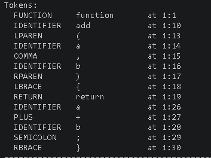
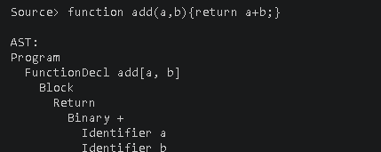

# Topic: Parser & Building an Abstract Syntax Tree

### Course: Formal Languages & Finite Automata
### Author: Student

----

## Theory
Parsing is the process of taking a sequence of tokens and extracting its syntactic structure according to the rules of a language. The result is often a tree representation that shows how the input is organized.

An Abstract Syntax Tree (AST) is a simplified tree representation of the same input. Unlike a full parse tree, it keeps only the relevant constructs needed for later stages such as semantic analysis, interpretation, or compilation.

In this lab, the parsing stage continues the work from the lexical analysis lab by taking tokenized input and building a structured AST.

## Objectives:
1. Get familiar with parsing and how it can be implemented.
2. Get familiar with the concept of an Abstract Syntax Tree.
3. Extend the work from lab 3 by:
   1. having a `TokenType` type used to categorize tokens
   2. using regular expressions to identify token types
   3. implementing the necessary AST data structures
   4. implementing a simple parser that extracts syntactic information from the input text

## Implementation description
The laboratory work is implemented in Java as a compact pipeline:

- `TokenType.java` defines the token categories and the regular expression used for each one.
- `Token.java` stores the token type, lexeme, and source position.
- `Lexer.java` performs lexical analysis and converts the source text into a stream of tokens.
- `ASTNode.java` defines the AST interface and the concrete node types used by the parser.
- `Parser.java` implements a recursive descent parser.
- `Main.java` runs several examples and prints both the token stream and the AST.

General flow:

```text
source code -> tokens -> AST
```

### TokenType and regex-based token recognition
One of the explicit task requirements is to have a type similar to an enum for token categories and to use regular expressions for token identification. This is implemented directly in `TokenType.java`.

Examples:

```java
FUNCTION("function\\b"),
RETURN("return\\b"),
VAR("var\\b"),
NUMBER("\\d+(?:\\.\\d+)?"),
IDENTIFIER("[A-Za-z_][A-Za-z0-9_]*")
```

Each token type stores a compiled regex pattern. The lexer scans the remaining input and picks the first token type whose regex matches at the current position.

```java
Matcher matcher = type.pattern().matcher(remaining);
if (matcher.lookingAt()) {
    String lexeme = matcher.group();
    Token token = new Token(type, lexeme, line, column);
    advance(lexeme);
    return token;
}
```

This satisfies the requirement of using regular expressions during lexical analysis.

### Lexer
The lexer also tracks line and column numbers, which helps with debugging and parser error messages. Whitespace and comments are still recognized as token types, but they are marked as ignored and are not included in the final token stream.

### AST structures
The AST required by the task is implemented in `ASTNode.java`. The current node set includes:

- `ProgramNode`
- `BlockNode`
- `VariableDeclarationNode`
- `FunctionDeclarationNode`
- `ReturnNode`
- `IfNode`
- `ExpressionStatementNode`
- `AssignmentNode`
- `BinaryNode`
- `UnaryNode`
- `CallNode`
- `IdentifierNode`
- `LiteralNode`

This structure is enough to represent the example language used in the lab, which extends the expression-oriented language from lab 3 with assignments, declarations, and control flow.

### Parser
The parser is implemented as a recursive descent parser. It supports:
- variable declarations
- function declarations
- return statements
- if / else blocks
- assignments
- arithmetic expressions
- comparison and logical expressions
- function calls

Operator precedence is handled through separate parsing methods:
- assignment
- logical OR / AND
- equality
- comparison
- addition / subtraction
- multiplication / division / modulo
- power
- unary
- primary

Example:

```java
private ASTNode parseTerm() {
    ASTNode node = parseFactor();
    while (match(TokenType.PLUS) || match(TokenType.MINUS)) {
        Token operator = previous();
        node = new BinaryNode(operator.lexeme(), node, parseFactor());
    }
    return node;
}
```

## Program execution
`Main.java` demonstrates the implementation on several inputs. For each one the program prints the source text, the token stream with line/column positions, and the AST in indented tree form.

**Example 1** — `var z = sin(0.5) + cos(2) - 3.14 ^ 2 / x;`

```text
Tokens:
  VAR          var          at 1:1
  IDENTIFIER   z            at 1:5
  ASSIGN       =            at 1:7
  IDENTIFIER   sin          at 1:9
  LPAREN       (            at 1:12
  NUMBER       0.5          at 1:13
  RPAREN       )            at 1:16
  PLUS         +            at 1:18
  IDENTIFIER   cos          at 1:20
  LPAREN       (            at 1:23
  NUMBER       2            at 1:24
  RPAREN       )            at 1:25
  MINUS        -            at 1:27
  NUMBER       3.14         at 1:29
  CARET        ^            at 1:34
  NUMBER       2            at 1:36
  SLASH        /            at 1:38
  IDENTIFIER   x            at 1:40
  SEMICOLON    ;            at 1:41

AST:
Program
  VarDecl z
    Binary -
      Binary +
        Call sin
          Number 0.5
        Call cos
          Number 2
      Binary /
        Binary ^
          Number 3.14
          Number 2
        Identifier x
```

The AST reflects operator precedence correctly: `^` binds tighter than `/`, which binds tighter than `-`.

**Example 2** — `if (x > 10) { var y = 5; } else { var y = 0; }`

```text
AST:
Program
  If
    Condition
      Binary >
        Identifier x
        Number 10
    Then
      Block
        VarDecl y
          Number 5
    Else
      Block
        VarDecl y
          Number 0
```

**Example 3** — `function add(a, b) { return a + b; }`

```text
AST:
Program
  FunctionDecl add[a, b]
    Block
      Return
        Binary +
          Identifier a
          Identifier b
```

**Example 4** — `var result = (a + b) * (c - d);`

```text
AST:
Program
  VarDecl result
    Binary *
      Binary +
        Identifier a
        Identifier b
      Binary -
        Identifier c
        Identifier d
```

Parenthesised sub-expressions are grouped correctly: both `(a + b)` and `(c - d)` become children of the `*` node, overriding the usual precedence.

## Conclusions / Screenshots / Results

**Token output** for `function add(a,b){return a+b;}`:



**AST output** for the same input:



The implementation satisfies all task requirements:
- `TokenType` is defined as a Java enum with one entry per category
- every token type carries a compiled `Pattern` so the lexer uses regular expressions to identify tokens
- `ASTNode.java` provides the full hierarchy of node types needed to represent the example language
- the recursive-descent parser correctly handles declarations, control flow, assignments, and expressions with proper operator precedence

All four example inputs parse without errors, and the printed ASTs match the expected structure. The code is organized clearly into separate files for each concern (lexing, token model, AST, parsing) and is straightforward to present at the lab defense.

## References
- [Parsing Wiki](https://en.wikipedia.org/wiki/Parsing)
- [Abstract Syntax Tree Wiki](https://en.wikipedia.org/wiki/Abstract_syntax_tree)
- [Recursive descent parser](https://en.wikipedia.org/wiki/Recursive_descent_parser)
